## README ##
This application solves the problem of LAN attacks and data sniffing. It can perform point-to-point attacks on any target terminal in the LAN to sniff the target terminal's upstream and downstream internet data. Aiming at the multi-source heterogeneity and real-time nature of network data, a targeted detection and monitoring engine is designed in combination with MongoDB's natural NoSQL characteristics.
```
1. Server: The core technology used in the backend is SpringBoot. The core technologies used for network attacks include winpcap, jpcap, ARP Spoofing (ARP deception), MITM (Man-in-the-Middle Attack), and network packet grouping/degrouping, decompression, and restoration.
2. Client: The core technologies used in the frontend include Angular6, ECharts, etc.
3. Packaging and Deployment: The front-end and back-end are packaged into the same jar file using Maven.
```


#### 1. Environment Configuration ####

##### 1) macOS

###### Required Software Downloads and Installations
1. Java (do not select 64-bit): [Java Download](https://www.java.com/en/download/manual.jsp)
2. MongoDB (must choose 3.4.24): [MongoDB Download](https://www.mongodb.com/try/download/community)
3. WinPcap latest: [WinPcap Download](https://www.winpcap.org/install/default.htm)
4. Wireshark: [Wireshark Download](https://2.na.dl.wireshark.org/osx/Wireshark%203.4.5%20Intel%2064.dmg)
5. Maven, NodeJS

###### Required Configurations
1. Enable IP forwarding: `sudo sysctl -w net.inet.ip.forwarding=1`. Check if IP forwarding is enabled (should be 1): `sudo sysctl -a | grep net.inet.ip.forwarding`. After system restart, IP forwarding will revert to default off state, so it must be re-enabled; otherwise, the target under attack will not be able to access the internet normally.
2. Add the absolute path of the bin directory in the MongoDB installation directory to the environment variable path to start the MongoDB service from the command line.
3. Copy `libjpcap.jnilib` to `/Library/Java/Extensions/`.
4. Ensure that the server running this program and the target mobile phone are connected to the same router via Wi-Fi.
5. Navigate to the root directory of the code in the command line, compile and package using Maven: `mvn package -Dmaven.test.skip=true`, copy `jpcap-mitm.jar` to any directory as the working directory, and create a `data/db` folder in this working directory as the MongoDB data folder.
6. Open the downloaded Wireshark dmg package, you will see an `Install ChmodBPF.pkg` package, double-click to install this software package.

###### Startup Steps
1. Open Terminal, navigate to the specified working directory, and run `mongod --dbpath=data/db`. After a few seconds, wait for the MongoDB service to successfully run and print a log similar to: *** waiting for connections on port 27017.
2. Click the Windows start button at the bottom left, type `cmd`, then right-click to run the command line as administrator. Navigate to `D:\mitm` in the command line, then run `java -jar jpcap-mitm.jar`. Wait for the service to successfully run and print a log similar to: *** Started Application in ** seconds.
3. Open Chrome browser and navigate to `http://localhost:8888`, or access the program remotely from another device via `http://<local IP>:8888`.
4. After successfully opening the management site of this program, select the correct network card at `Select interface`, set the local IP and MAC, target mobile IP and MAC, gateway (router) IP and MAC. Note that these are all internal network IPs and should be on the same subnet.
5. The IP and MAC of the target mobile phone can be viewed in the Wi-Fi connection information on the phone. If you do not know the local IP and MAC or the router's IP and MAC, enter `ifconfig` in Terminal to find the IPv4 Address, Physical Address, and Default Gateway. Run `arp -a` to find the gateway's MAC.
6. After setting the above information, click the setting button, then the application will establish the corresponding connection. Each time the program starts, you can reset the connection, but once set, it cannot be modified. To reset, close the `jpcap-mitm.jar` process in the command line window by pressing `control+c`, then restart the program.
7. Before starting the attack, try using the target mobile phone to access websites or apps. Ensure the phone can access the internet normally without starting the attack.
8. After clicking start attack, wait for a few seconds for the attack to take effect and display the dynamic bar. Check the data on the real-time statistics panel below and use the target mobile phone to access websites or apps to see the data panel updates.
9. After completing the website or app functions, click stop attack. The attack will immediately stop, but the server captured a large number of packets that need to be sequentially stored, so the real-time statistics panel data may continue to slowly increase for a few minutes before stopping.
10. After stopping the attack, wait for a few seconds for the message that packet analysis is complete. You can then select the batch ID (latest ID) of this attack on the analysis, statistics, and dump pages to view detailed content and charts.

###### Notes
1. If a web error prompt appears, check if the command line jar package has exited abnormally. The program may have crashed. Try restarting the jar. Pay attention to the command line log of the program. If errors are continuously thrown, the program may not be able to sniff packets normally. Try restarting the jar.
2. If the router has static IP/MAC binding enabled, DHCP disabled, or ARP attack defense modules, it may cause the program to only intercept upstream packets and not downstream packets. If the router settings cannot be configured, switch to different equipment and attack again. If the gateway device is very powerful, the attack may not be completely successful.
3. After starting the attack, if the target can access the internet normally but no packets are sniffed in the program's management page, or the target cannot access the internet, check if IP forwarding is enabled on the system, carefully check the IP and MAC of all devices configured in the web, check if the selected network card interface is correct, check if the server and the target mobile phone are connected to the same router, check if the target mobile phone's IP has changed (can be fixed IP), check if the command line window running the jar is run as administrator, try restarting the computer and waiting for several minutes before retrying.
4. The attack should not last too long, a few dozen seconds is optimal. After testing, stop the attack to prevent continuous attacks on the target and gateway causing a data storm in the LAN, which may overload the gateway and cause the entire LAN to crash.

##### 2) Windows

###### Required Software Downloads and Installations
1. Java (do not select 64-bit): [Java Download](https://www.java.com/en/download/manual.jsp)
2. MongoDB (must choose 3.4.24): [MongoDB Download](https://www.mongodb.com/try/download/community)
3. WinPcap latest: [WinPcap Download](https://www.winpcap.org/install/default.htm)
4. Maven, NodeJS

###### Required Configurations
1. Enable IP forwarding: Click the Windows start button at the bottom left, type `regedit`, then select the registry editor. Right-click to run the registry editor as administrator. Navigate to the registry key `HKEY_LOCAL_MACHINE/SYSTEM/CurrentControlSet/Services/Tcpip/Parameters`, select the `IPEnableRouter` item and change the value to 1.
2. Add the absolute path of the bin directory in the MongoDB installation directory to the environment variable path to start the MongoDB service from the command line.
3. Create a working directory for this program. For example, create the folder `D:\mitm` as the working directory. In the same root directory as the working directory, create the MongoDB data folder `data/db`. For example, if the root directory is `D`, create the folder `D:\data\db`.
4. Ensure that the server running this program and the target mobile phone are connected to the same router via Wi-Fi.
5. Navigate to the root directory of the code in the command line, compile and package using Maven: `mvn package -Dmaven.test.skip=true`, copy `jpcap-mitm.jar` and `Jpcap.dll` to the working directory, and create a `data/db` folder in this working directory as the MongoDB data folder.

###### Startup Steps
1. Click the Windows start button at the bottom left, type `cmd`, then right-click to run the command line as administrator. Navigate to `D:\`, then run `mongod`. After a few seconds, wait for the MongoDB service to successfully run and print a log similar to: *** waiting for connections on port 27017. Do not use the left mouse button to select any content in the command line window. The selected state will cause the service to be suspended.
2. Click the Windows start button at the bottom left, type `cmd`, then right-click to run the command line as administrator. Navigate to `D:\mitm` in the command line, then run `java -jar jpcap-mitm.jar`. Wait for the service to successfully run and print a log similar to: *** Started Application in ** seconds.
3. Open Chrome browser and navigate to `http://localhost:8888`, or access the program remotely from another device via `http://<local IP>:8888`.
4. After successfully opening the management site of this program, select the correct network card at `Select interface`, set the local IP and MAC, target mobile IP and MAC, gateway (router) IP and MAC. Note that these are all internal network IPs and should be on the same subnet.
5. The IP and MAC of the target mobile phone can be viewed in the Wi-Fi connection information on the phone. If you do not know the local IP and MAC or the router's IP and MAC, click the Windows start button at the bottom left, type `cmd`, then right-click to run the command line as administrator. Enter `ipconfig /all` in the command line to find the Wireless LAN adapter Wi-Fi section, find the IPv4 Address, Physical Address, and Default Gateway. Run `arp -a` to find the gateway's MAC.
6. After setting the above information, click the setting button, then the application will establish the corresponding connection. Each time the program starts, you can reset the connection, but once set, it cannot be modified. To reset, close the `jpcap-mitm.jar` process in the command line window by pressing `control+c`, then restart the program.
7. Before starting the attack, try using the target mobile phone to access websites or apps. Ensure the phone can access the internet normally without starting the attack.
8. After clicking start attack, wait for a few seconds for the attack to take effect and display the dynamic bar. Check the data on the real-time statistics panel below and use the target mobile phone to access websites or apps to see the data panel updates.
9. After completing the website or app functions, click stop attack. The attack will immediately stop, but the server captured a large number of packets that need to be sequentially stored, so the real-time statistics panel data may continue to slowly increase for a few minutes before stopping.
10. After stopping the attack, wait for a few seconds for the message that packet analysis is complete. You can then select the batch ID (latest ID) of this attack on the analysis, statistics, and dump pages to view detailed content and charts.

###### Notes
1. If a web error prompt appears, check if the command line jar package has exited abnormally. The program may have crashed. Try restarting the jar. Pay attention to the command line log of the program. If errors are continuously thrown, the program may not be able to sniff packets normally. Try restarting the jar.
2. If the router has static IP/MAC binding enabled, DHCP disabled, or ARP attack defense modules, it may cause the program to only intercept upstream packets and not downstream packets. If the router settings cannot be configured, switch to different equipment and attack again. If the gateway device is very powerful, the attack may not be completely successful.
3. After starting the attack, if the target can access the internet normally but no packets are sniffed in the program's management page, or the target cannot access the internet, check if IP forwarding is enabled on the system, carefully check the IP and MAC of all devices configured in the web, check if the selected network card interface is correct, check if the server and the target mobile phone are connected to the same router, check if the target mobile phone's IP has changed (can be fixed IP), check if the command line window running the jar is run as administrator, try restarting the computer and waiting for several minutes before retrying.
4. If the naming in the network card interface list cannot determine which one to select, open the registry editor and check the registry key `HKEY_LOCAL_MACHINE\SYSTEM\CurrentControlSet\Services\Tcpip\Parameters\Interfaces\{*}`. This list corresponds to the interface list. Check each interface item in turn and see which configuration matches the current server IP, indicating the interface we need to select.
5. The attack should not last too long, a few dozen seconds is optimal. After testing, stop the attack to prevent continuous attacks on the target and gateway causing a data storm in the LAN, which may overload the gateway and cause the entire LAN to crash.


#### 2. Program Description ####

The front-end interface of this project is as follows

1. LAN Attack Page

    1. In this interface, set the network card and the IP and MAC of the local machine/target/gateway, set the monitored domain list (one domain or multiple domains separated by commas), and then control the start or stop of the attack.
    2. The first step is to make necessary settings. These settings can only be made after the program is newly started each time. The information will be saved to the database, and the program will automatically read this information when it is started next time. When the program is started for the first time, it will automatically read the local IP and MAC. This needs to be carefully confirmed to be correct. The network card needs to select the network card device used for normal internet access. The target refers to the mobile phone or other devices we need to monitor. The gateway generally refers to the router or other gateway devices to which we are connected via Wi-Fi. All of the above information must be strictly configured correctly, otherwise the program cannot run normally. The setting interface is shown in the figure below:
       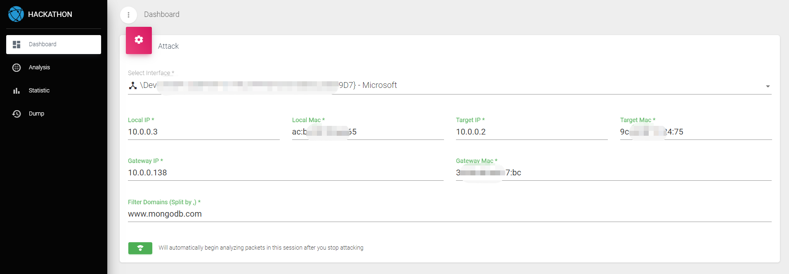
    3. The gateway IP and MAC can be viewed on the gateway device, or they can also be seen from the local routing table, as shown in the figure below:
       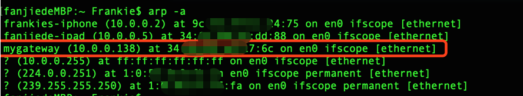
    4. When we finish the configuration and save or start the attack, the domain name address list to be monitored will be resolved by DNS and the corresponding IP list will be updated to MongoDB, and then the LAN attack and data sniffing will officially start. The interface will show the attack status, as shown in the figure below:
       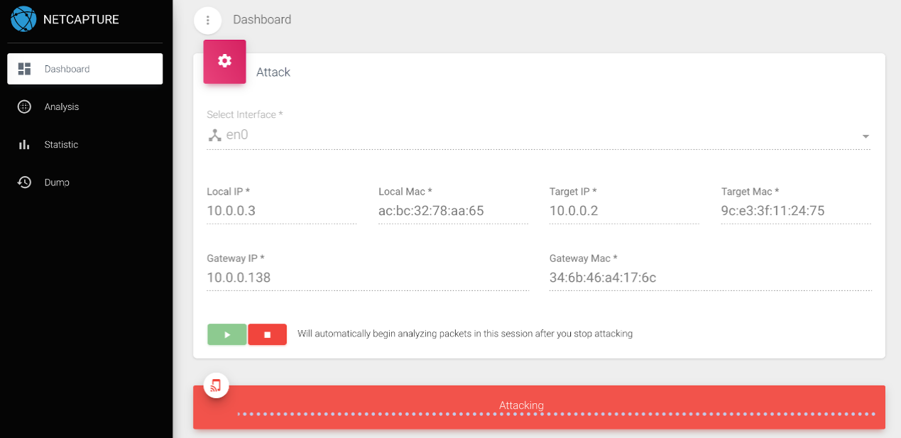
    5. At this time, you can drag the page to the lower part to view the packet sniffing statistics. The statistics part is mainly divided into two types: upstream and downstream, which are further divided into TCP/UDP/ICMP/ARP four types. Upstream means the packets sent from the target, and downstream means the packets received by the target. If the target is not browsing the specified domain list at this time, all statistics will always be 0. If it starts browsing the specified domain list, you can see that the statistics start to have data, as shown in the figure below:
       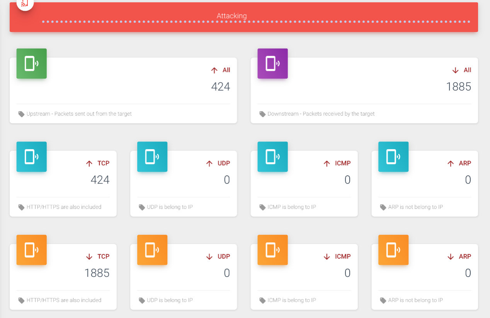
    6. When we stop the attack, a detailed analysis of the packets in this attack will automatically start. After the attack is completed, there will also be a pop-up prompt, as shown in the figure below:
       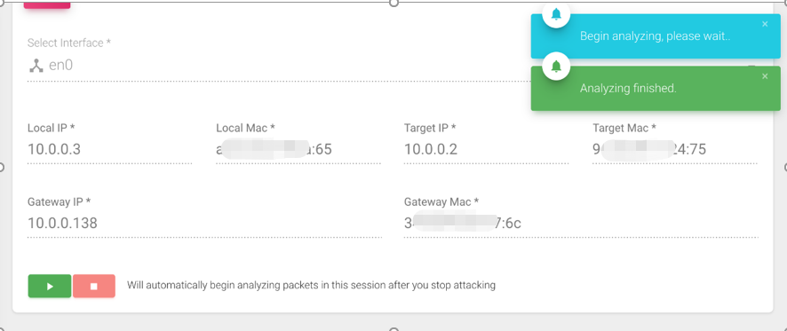

2. Packet Analysis Page

    1. In this interface, it will first show whether the packet analysis process is in progress. If it is still being analyzed, you need to wait for the analysis to be completed before viewing the results. After the analysis is completed, the status will automatically switch to completed, and you can view the analysis results.
    2. First, we can choose a packet filter: attack batch id/upstream or downstream/protocol/content. Each filter item can be multi-selected or left blank, which means all types are matched. After clicking filter, the first table below will show all the matched packets after analysis. Note that the packets here are different from those in the attack interface. The packets here are all combined packets, while those in the attack interface are original frames. Therefore, the number of packets here is much smaller than before. In the first table, we can see all the important fields of the packets, including some fields after analysis (such as HTTP header/HTTP body/METHOD, etc.), as shown in the figure below:
       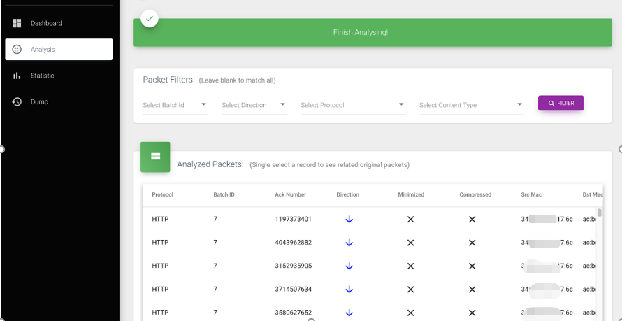
    3. After clicking any row in the first table, check the second table below to see which original data frames correspond to this packet. We can see some basic frame fields of these packets here, as shown in the figure below:
       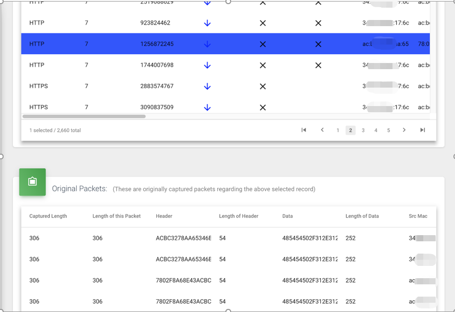

3. Packet Statistics Page

    1. Similarly, in this interface, it will first show whether the packet analysis process is in progress. If it is still being analyzed, you need to wait for the analysis to be completed before viewing the results. After the analysis is completed, the status will automatically switch to completed, and you can view the analysis results.
    2. First, we can filter based on the attack batch, which can be multi-selected or left blank, which means all attack batches are matched, as shown in the figure below:
       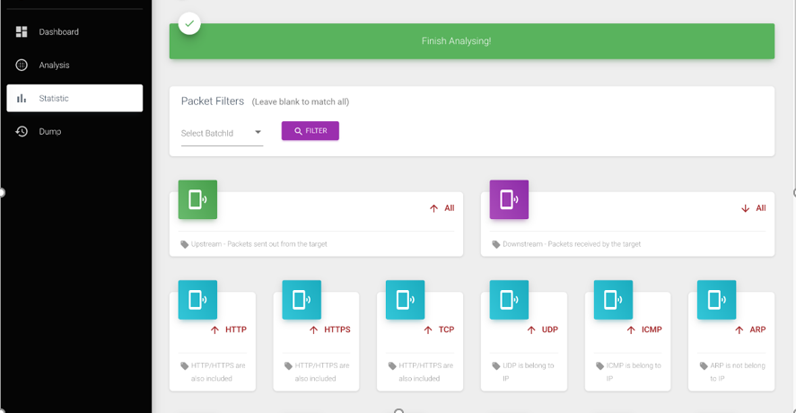
    3. After clicking filter, you can first see the packet statistics of various detailed protocol types, mainly divided into two categories: upstream and downstream, each of which is further divided into HTTP/HTTPS/TCP/UDP/ICMP/ARP protocol types. Note that TCP here refers to other TCP protocol types except HTTP and HTTPS, while HTTP and HTTPS are specially and commonly analyzed and counted separately. The statistics interface is shown in the figure below:
       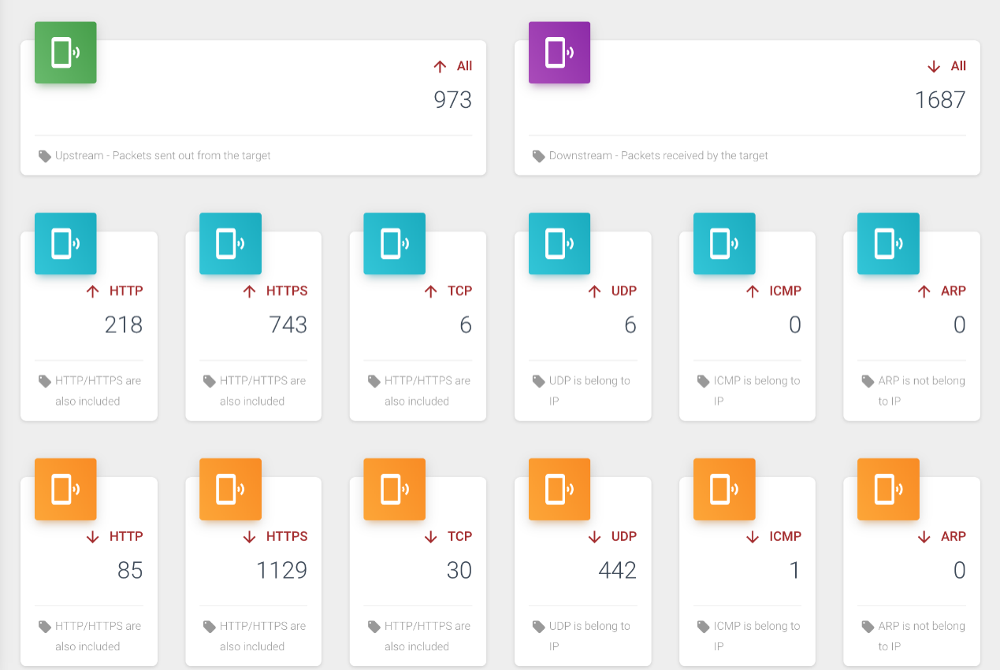
    4. Continuing to look down, you can also see pie charts of each protocol type, divided into two categories: upstream and downstream, as shown in the figure below:
       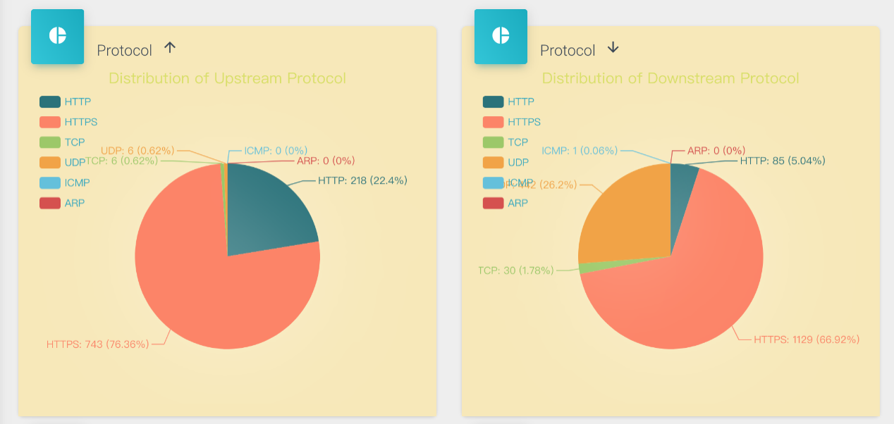
    5. Similarly, you can also see pie charts of each content type, divided into two categories: upstream and downstream, where `other` refers to other TCP packets except HTTP/HTTPS and packets of other protocols that cannot be analyzed. Since the actual content of such packets cannot be analyzed, they are uniformly classified as `other`, as shown in the figure below:
       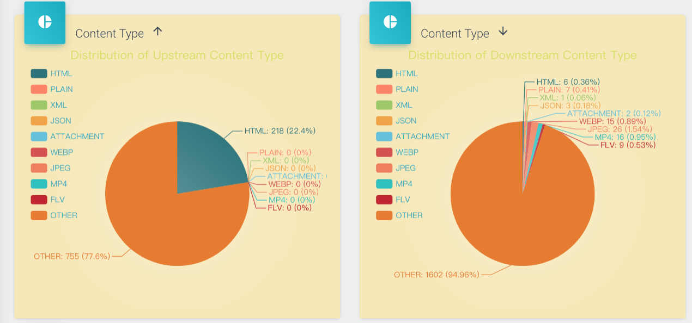
    6. We can also see the distribution of different packet contents based on the timeline. The multi-line graph at the bottom shows the trend changes of various packet contents, while the pie chart at the top interacts with the mouse. When the mouse moves on the x-axis of the multi-line graph, the pie chart will show the statistics and proportions of various packet contents at the current time on the x-axis in real-time, as shown in the figure below:
       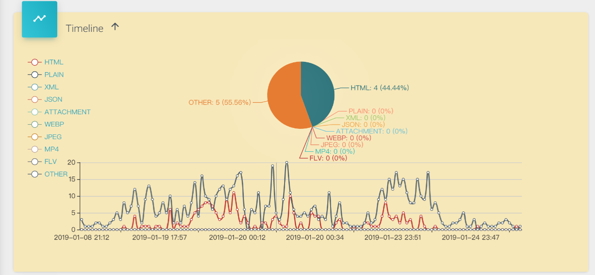
    7. Similarly, the timeline chart is also divided into upstream and downstream, as shown in the figure below, which shows the downstream data:
       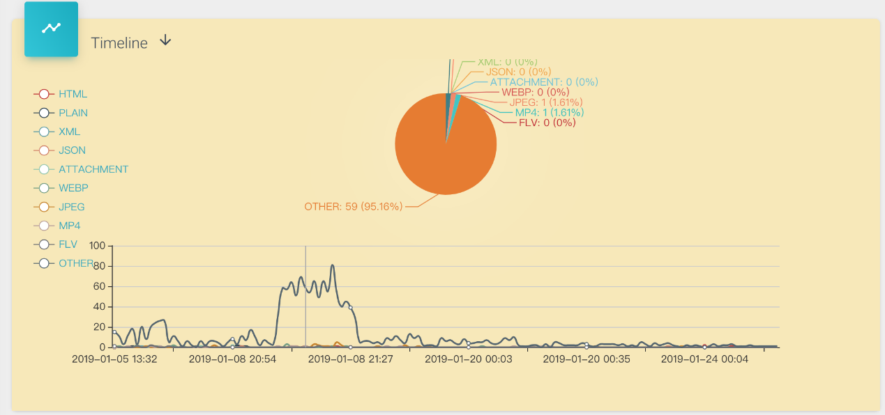

4. Packet Warehouse Page

    1. In this page, we can see the basic data of each attack, such as attack ID/attack time/number of upstream data frames/number of downstream data frames, etc. We can also operate on each attack process, reanalyze, or delete all related packets and analysis results, as shown in the figure below:
       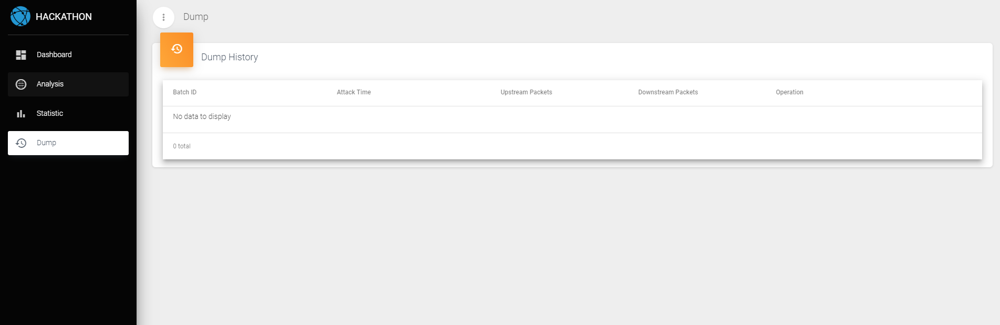


### Contribution ###
* Frankie Fan (hustakin@gmail.com)
